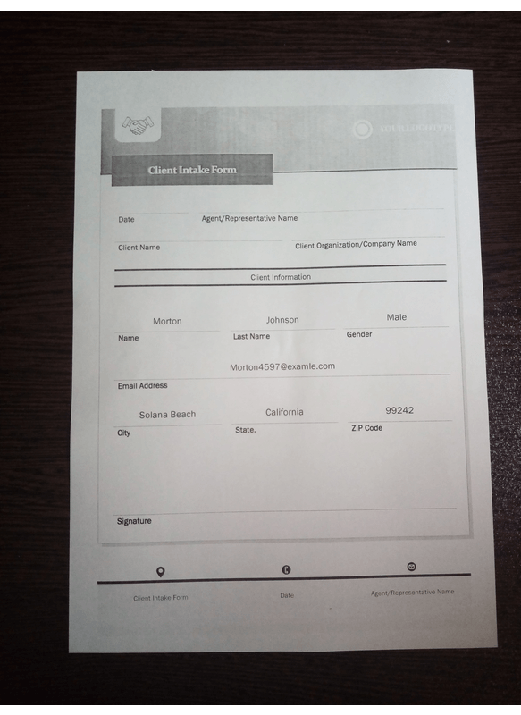

# document-invoice

### 📝Description
---
In this repository, we are going to implement a very interesting project that is called `Document Invoice`. The main application of this API is reading a document and inserting its information into a database. This process can be done automatically without human interference. Just take a photo from the form in an appropriate position, and pass it into a program. All of the pieces of information have been passed into the database. 

This application contains three main sections. The first one is image scanning. To do this, we have to create an API to get an input form, apply some image preprocessing, and then output the scanned image with **high-resolution quality**. We want high-resolution scanned images because the output accuracy of the Optical Character Recognition (OCR) application, which is `pytesseract` is highly dependent on the image quality.

The second section is to define the OCR function to grab the preprocessed form and extract each and every piece of information from pre-specified locations. The last step is to create an SQL database and connect it to the Python file. 

We will be going through these subcategories more deeply in the next section. 

### 🖥 Installation
---
The Code is written in Python 3.7.5. If you don't have Python installed, you can find it [here](https://www.python.org/downloads/). If you are using a lower version of Python, you can upgrade using the pip package to ensure you have the latest version of pip. To install the required packages and libraries, run this command in the project directory after cloning the repository:
```
git@github.com:git@github.com:Kasra1377/document-invoice.git
```
or
```
git clone https://github.com/Kasra1377/document-invoice.git
```
After you clone this repository, you have to download and install the Anaconda. You can find the download link from this [link](https://www.anaconda.com/products/individual). After the installation, open the Anaconda Prompt and type the code down below:
```
conda create -n scanner python=3.7
```
This command creates a virtual env with the name of `scanner`. Note that you can choose your own arbitrary name for the virtual environment. After the virtual environment is created,  switch to the directory of the project folder via Anaconda Prompt and then type:

```
conda activate scanner
```
This command activates your own virtual environment that you have just created. In order to install all of the libraries used in this project, you have to type:

```
conda install file requirements.txt
```

By doing this and downloading all of the required packages, you are ready to run this project on your local computer.

### 🛠Project Structure
---

#### Image Scanning

It is the most important step in this project. Because it contains an image preprocessing step. Without appropriate preprocessing operations, we are not able to get appropriate results. Our image preprocessing steps mostly contain: `contour detection`, `morphological operations`, and `image sharpening`. Thanks to this [repository](https://github.com/andrewdcampbell/OpenCV-Document-Scanner) most of the programming steps already is done.

If you want to gain more information from the image processing steps, please refer to `document_validation.py` and `document_scanner.py` files.


#### OCR'ing The Scanned Image

The next important step is to read the document fields. To do so, we use the Pytesseract program to reach our purpose. You can download the Pytesseract installer via this [link](https://github.com/UB-Mannheim/tesseract/wiki). To complete this task, we defined two functions; `clearup_text` to omit words that OCR can not read and `documentOCR`. In this function, we utilized `namedtuples` for grouping objects without defining a class. It is one of the important features that Python has.

> namedtuples are immutable containers, just like regular
tuples. Once you store data in top-level attribute on a namedtuple,
you can’t modify it by updating the attribute. All attributes on a
namedtuple object follow the “write once, read many” principle.
Each object stored in them can be accessed through a unique (human-readable)
identifier. This frees you from having to remember integer indexes,
or resorting to workarounds like defining integer constants as
mnemonics for your indexes.

--- Page 130, [Python Tricks The Book A Buffet of Awesome Python Features](https://www.amazon.com/Python-Tricks-Buffet-Awesome-Features/dp/1775093301)

To create a namedtuple, we have to define a `typename` and define a name for each field, put the names into a list, and pass it into the `namedtyple` API. The fields are: `id`, which is the ID of each field in the form, `bbox`, which is the bounding box points for each field and the last one is `filter-keywords`, which is the words that we filter in order to OCR do not recognize them as inputs. The words of this section mostly contain field names such as Name, Last Name, etc.



Please note that the photo of the form must be taken in an appropriate position, and the photo must be taken in high-resolution quality. Otherwise, this program does not output accurate results.

#### Database Connection
The last step is the connection between the SQL database and Python files. In this specific project, I selected the MySQL platform, and to run this project on your local computer, you have to download MySQL from this [link](https://dev.mysql.com/downloads/workbench/). In addition `my-sql.connector` library must be installed on your computer. To install it, open up your Command Prompt and type:

```
pip install mysql-connector-pytho
```
Or you can type the below command if you want to install this library in Anaconda Prompt:

```
conda install -c anaconda mysql-connector-python
```
After the installation, open up the MySQL program and create a Connection. Give it a name and a `password` and set the `user` to `root`. After that create a database:

```sql
CREATE DATABASE documents;
```
And select this database:

```sql
USE documents;
```
After that, create a table with the name `documents`:

```sql
CREATE TABLE documents (
name VARCHAR(30),
last_name VARCHAR(50),
gender VARCHAR(6),
email VARCHAR(50),
city VARCHAR(30),
state VARCHAR(30),
zip_code VARCHAR(12),
)
```

Now go to the `record.py` file and change the script password down below:

```python
mydb = mysql.connector.connect(
    host="127.0.0.1",
    user="root",
    password="your password",
    database="documents",
)

```
After doing this, the installation is done, and you are ready to run the project on your local computer. Please note that you have to run the `main.py` python file to automate all of the processes.

After you run the program successfully, go back to the MySQL program and type:
```sql
SELECT * FROM documents;
```
As you can see, the program successfully detected most of the fields.

### Result
---
<p align="center">
  
</p>
 
As this picture shows, this program successfully detects most of the fields from different documents, but some of them are incorrect mainly because of two reasons: The picture of the input form was not taken in an appropriate position, and the second reason is the performance of Pytesseract. Pytesseract sometimes, and in some situations, does not detect texts properly.

### 🛠Technologies Used
---
**IDE**:  


**Language(s):**  

**Libraries:**      
    

**Database(s):**  

### ❌Bugs & Issues
---
If you ever encounter any bugs or technical issues in this project, you can report it to the `issues` section of this repository, or you can contact me by my email address. 

### 👥Contributers
---
Kasra1377
